# HomeHUB System Documentation

> **A Comprehensive Guide to the Home Environmental Monitoring System**

---

## Table of Contents
1. [System Overview](#system-overview)
2. [Architecture Diagram](#architecture-diagram)
3. [Hardware Components](#hardware-components)
4. [ESP32 Sensor Nodes](#esp32-sensor-nodes)
5. [Flask Server](#flask-server)
6. [Web Dashboard](#web-dashboard)
7. [Data Flow](#data-flow)
8. [API Reference](#api-reference)
9. [Configuration Guide](#configuration-guide)

---

## System Overview

HomeHUB is an IoT-based home environmental monitoring system that collects sensor data from ESP32 microcontrollers distributed around your home and displays it on a centralized touch-friendly web dashboard.

### Key Capabilities

| Feature | Description |
|---------|-------------|
| **Multi-Room Monitoring** | Monitor temperature, humidity, light, and sound in multiple rooms |
| **Real-Time Updates** | Dashboard auto-refreshes every 10 seconds |
| **Weather Integration** | Live weather data and 5-day forecasts via OpenWeatherMap |
| **To-Do List** | Built-in task management with persistent storage |
| **Touch-Friendly UI** | Optimized for 7-inch HDMI touchscreen displays |
| **Kiosk Mode** | Full-screen display mode for dedicated monitoring |

---

## Architecture Diagram

```mermaid
flowchart TB
    subgraph Sensors["ESP32 Sensor Nodes"]
        ENV["🌡️ Env Node<br/>DHT22 + Microphone"]
        LIGHT["💡 Light Node<br/>BH1750 Sensor"]
        ENV2["🌡️ Env Node 2<br/>Living Room"]
    end
    
    subgraph Network["WiFi Network (2.4GHz)"]
        ROUTER["📶 Router"]
    end
    
    subgraph Server["Python Flask Server"]
        FLASK["🖥️ HomeHUB_server_v2.py<br/>Port 5000"]
        LOG["📄 sensor_data_v2.log"]
        TODO["📝 todo_data.json"]
    end
    
    subgraph External["External Services"]
        WEATHER["🌤️ OpenWeatherMap API"]
    end
    
    subgraph Display["Dashboard"]
        WEB["🖼️ Touch-Friendly UI"]
    end
    
    ENV -->|HTTP POST /sensor-data| ROUTER
    LIGHT -->|HTTP POST /sensor-data| ROUTER
    ENV2 -->|HTTP POST /sensor-data| ROUTER
    ROUTER --> FLASK
    FLASK --> LOG
    FLASK --> TODO
    WEATHER -->|Weather Data| FLASK
    FLASK --> WEB
```



---

## Hardware Components

### ESP32 Microcontroller

The brain of each sensor node. The ESP32-D provides:
- **Dual-core** 240MHz processor
- **WiFi 2.4GHz** connectivity
- **4MB Flash** memory
- **ADC pins** for analog sensors
- **I2C bus** for digital sensors

### Sensors Used

| Sensor | Purpose | Interface | Pin(s) |
|--------|---------|-----------|--------|
| **DHT22** | Temperature & Humidity | Digital (1-Wire) | GPIO 4 |
| **MAX4466** | Audio/Sound Level | Analog | GPIO 35 |
| **BH1750** | Light Intensity (lux) | I2C | SDA=26, SCL=25 |

### Wiring Reference

```
┌─────────────────────────────────────────────────────────────┐
│                    ENV NODE WIRING                          │
├─────────────────────────────────────────────────────────────┤
│  ESP32 GPIO4   ──────────────────────  DHT22 DATA           │
│  ESP32 GPIO35  ──────────────────────  MAX4466 OUT          │
│  ESP32 3.3V    ──────────────────────  Sensor VCC           │
│  ESP32 GND     ──────────────────────  Sensor GND           │
└─────────────────────────────────────────────────────────────┘

┌─────────────────────────────────────────────────────────────┐
│                   LIGHT NODE WIRING                         │
├─────────────────────────────────────────────────────────────┤
│  ESP32 GPIO26  ────────────(I2C SDA)────  BH1750 SDA        │
│  ESP32 GPIO25  ────────────(I2C SCL)────  BH1750 SCL        │
│  ESP32 3.3V    ──────────────────────  BH1750 VCC           │
│  ESP32 GND     ──────────────────────  BH1750 GND + ADDR    │
└─────────────────────────────────────────────────────────────┘
```

---

## ESP32 Sensor Nodes

### Environmental Node (`HomeHUB_Env_Node_Laptop.ino`)

**Purpose:** Monitors temperature, humidity, and ambient sound levels.

#### How It Works


#### Key Classes

| Class | Purpose |
|-------|---------|
| `DHTSensor` | Encapsulates DHT22 reading with validation (rejects NaN, out-of-range values) |
| `MicrophoneSensor` | Samples audio at high frequency, tracks peak level between transmissions |

#### Configuration Constants

```cpp
#define WIFI_SSID "YOUR_WIFI_SSID"        // Your WiFi network
#define WIFI_PASSWORD "YOUR_WIFI_PASSWORD"      // WiFi password
#define SERVER_IP "YOUR_SERVER_IP"           // Server IP address
#define SERVER_PORT 5000                // Flask server port
#define DEVICE_NAME "HomeHUB_Env_Node"  // Unique device identifier

#define DHT_PIN 4                       // DHT22 data pin
#define MIC_PIN 35                      // Microphone analog pin
#define WIFI_SEND_INTERVAL 10000        // Send data every 10 seconds
```

#### JSON Payload Format

```json
{
  "device_name": "HomeHUB_Env_Node",
  "sensors": {
    "temperature": 23.5,
    "humidity": 45.2,
    "audio_peak": 120
  }
}
```

---

### Light Node (`HomeHUB_Light_Node_Laptop.ino`)

**Purpose:** Monitors ambient light levels using the BH1750 digital light sensor.

#### How It Works

1. **I2C Initialization:** Configures GPIO 26 (SDA) and GPIO 25 (SCL) for I2C
2. **Sensor Mode:** Uses `CONTINUOUS_HIGH_RES_MODE` for accurate lux readings
3. **Polling:** Reads light level every 10 seconds
4. **Transmission:** Sends JSON data to server via HTTP POST

#### Configuration Constants

```cpp
#define I2C_SDA_PIN 26          // I2C Data pin
#define I2C_SCL_PIN 25          // I2C Clock pin
#define BH1750_ADDRESS 0x23     // Sensor I2C address (ADDR pin to GND)
#define SENSOR_READ_INTERVAL 10000  // 10 seconds
```

#### JSON Payload Format

```json
{
  "device_name": "HomeHUB_Light_Node",
  "sensors": {
    "light": 234.5
  }
}
```

---

## Flask Server

### Server File: `HomeHUB_server_v2.py`

The Flask server is the central hub that:
1. **Receives** sensor data from ESP32 nodes via HTTP POST
2. **Stores** readings in memory and logs to file
3. **Aggregates** data by room (multiple devices → single room)
4. **Serves** the web dashboard with real-time updates
5. **Fetches** weather data from OpenWeatherMap

### Core Components


### Room Configuration

Devices are grouped into logical rooms in the `ROOM_CONFIG` dictionary:

```python
ROOM_CONFIG = {
    "Bedroom": ["HomeHUB_Env_Node", "HomeHUB_Light_Node"],
    "Living Room": ["HomeHUB_Env_Node_2"],
}
```

When multiple devices report data for the same room, their sensor readings are **merged** to create a complete picture:
- Bedroom gets temperature/humidity from Env Node AND light level from Light Node
- Each room shows the most recent timestamp from any of its devices

### Sensor Interpretation Functions

Raw sensor values are converted to human-readable labels:

| Function | Input Range | Output |
|----------|-------------|--------|
| `interpret_audio()` | 0-50 | "Quiet" |
| | 51-500 | "Talking" |
| | 500+ | "Loud" |
| `interpret_light()` | 0-50 lux | "Dark" |
| | 50-500 lux | "Bright" |
| | 500+ lux | "Very Bright" |

### Weather Integration

The server fetches weather data from OpenWeatherMap API:

```python
WEATHER_API_KEY = "f8750f0d79a614efa7c0bb4a4272c311"
WEATHER_CITY = "Calgary"
WEATHER_COUNTRY = "CA"
WEATHER_CACHE_DURATION = 600  # Cache for 10 minutes
```

Weather data includes:
- Current temperature, conditions, and icon
- Feels-like temperature
- Humidity and wind speed
- 5-day forecast with high/low temperatures

---

## Web Dashboard

### Main Dashboard (`/`)

The home page displays:

| Card | Content |
|------|---------|
| **Weather Card** | Current temperature, conditions, city |
| **To-Do Card** | Quick access to task list |
| **Room Cards** | One card per room with temperature/humidity |

Auto-refreshes every 10 seconds via JavaScript:
```javascript
setTimeout(() => location.reload(), 10000);
```

### Weather Page (`/weather`)

Detailed weather view with:
- Large temperature display
- Feels-like, humidity, wind speed
- 5-day forecast with daily icons

### Room Detail Page (`/room/<name>`)

Shows all sensors for a specific room:
- Temperature (°C)
- Humidity (%)
- Audio level (Quiet/Talking/Loud)
- Light level (Dark/Bright/Very Bright)
- Last updated timestamp

### To-Do Page (`/todo`)

Task management interface:
- Add new tasks via text input
- Toggle completion status
- Delete tasks
- Persistent storage in `todo_data.json`

---

## Data Flow

### Complete Data Journey


### Data Storage

| Storage | Purpose | Format |
|---------|---------|--------|
| `latest_readings{}` | In-memory cache for fast access | Python dict |
| `sensor_data_v2.log` | Persistent log of all readings | JSON lines |
| `todo_data.json` | To-do list persistence | JSON array |

---

## API Reference

### POST `/sensor-data`

**Purpose:** Receive sensor data from ESP32 nodes

**Request Body:**
```json
{
  "device_name": "HomeHUB_Env_Node",
  "sensors": {
    "temperature": 23.5,
    "humidity": 45.2,
    "audio_peak": 120
  }
}
```

**Response:**
```json
{"status": "success"}
```

---

### GET `/latest`

**Purpose:** Get aggregated room data

**Response:**
```json
{
  "Bedroom": {
    "sensors": {
      "temperature": 23.5,
      "humidity": 45.2,
      "audio_peak": 120,
      "light": 234.5
    },
    "received_at": "2025-12-25 00:30:00"
  },
  "Living Room": {
    "sensors": {
      "temperature": 22.0,
      "humidity": 40.0
    },
    "received_at": "2025-12-25 00:29:55"
  }
}
```

---

### GET `/api/weather`

**Purpose:** Get weather data via API

**Response:**
```json
{
  "current": { /* OpenWeatherMap current data */ },
  "forecast": { /* OpenWeatherMap 5-day forecast */ }
}
```

---

### To-Do API

| Method | Endpoint | Purpose |
|--------|----------|---------|
| GET | `/todo` | Display to-do page |
| POST | `/todo/add` | Add new task |
| POST | `/todo/toggle/<id>` | Toggle task completion |
| POST | `/todo/delete/<id>` | Delete task |

---

## Configuration Guide

### Adding a New Room

1. **Create new ESP32 node** with unique `DEVICE_NAME`
2. **Update server** `ROOM_CONFIG`:
   ```python
   ROOM_CONFIG = {
       "Bedroom": ["HomeHUB_Env_Node", "HomeHUB_Light_Node"],
       "Living Room": ["HomeHUB_Env_Node_2"],
       "Kitchen": ["HomeHUB_Kitchen_Node"],  # ← Add new room
   }
   ```
3. **Restart server** to apply changes

### Changing WiFi Network

Update these values in each `.ino` file:
```cpp
#define WIFI_SSID "Your_Network_Name"
#define WIFI_PASSWORD "Your_Password"
#define SERVER_IP "Your_Server_IP"  // Run 'ipconfig' on server
```

### Changing Weather Location

Edit in `HomeHUB_server_v2.py`:
```python
WEATHER_CITY = "YourCity"
WEATHER_COUNTRY = "YourCountryCode"  # e.g., "US", "UK", "CA"
```

### Running the Server

```bash
# Laptop/PC
cd C:\Users\ryanl\Desktop\HomeHUB
python HomeHUB_server_v2.py

# Raspberry Pi (with auto-start)
sudo systemctl start HomeHUB.service
```

### Accessing the Dashboard

| Device | URL |
|--------|-----|
| Local (same machine) | http://127.0.0.1:5000 |
| Network (other devices) | http://YOUR_IP:5000 |

---

## Troubleshooting

| Issue | Solution |
|-------|----------|
| **ESP32 not connecting** | Check WiFi is 2.4GHz, verify SSID/password |
| **No data on dashboard** | Verify server IP in firmware matches actual IP |
| **Sensor reading NaN** | Check wiring, ensure 3.3V power, allow warmup |
| **Weather not loading** | Check API key, verify internet connection |

---

*Last Updated: December 25, 2025*
